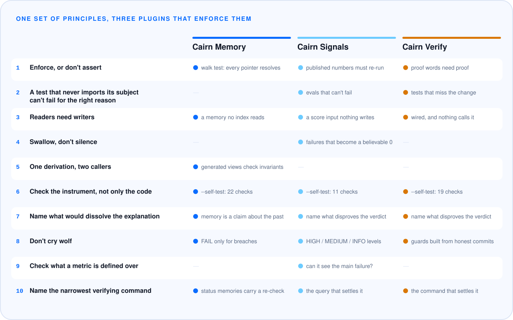

**[The plugins](#the-plugins)** · **[The principles](PRINCIPLES.md)** · **[Evidence](EVIDENCE.md)** · **[Case studies](#case-studies)** · **[Design decisions](DECISIONS.md)**

AI systems report on themselves in sentences and numbers: *the agent remembers we use
uv; confidence 92%; fixed, tested, all green.* Each one is a claim. Most are never checked,
and the ones that go wrong rarely throw an error. A note goes stale, a score's input stops
being written, a test gets skipped. The system keeps reporting, sounding just as sure.

Cairn is three Claude Code plugins that check those claims. They're built on one set of
principles, drawn from real incidents in production software written with coding agents.

A cairn is a stack of stones left to guide whoever comes next.

## The plugins

| Plugin | The claim it checks | Repo |
|---|---|---|
| **Cairn Memory** | *"The agent knows this."* Is each fact stored where it will be found, cheap to load, and still true? | [claude-md-memory-architecture](https://github.com/nicuk/claude-md-memory-architecture) |
| **Cairn Signals** | *"Confidence 92%."* Is each number the product shows fed by something real? | [llm-silent-failure-audit](https://github.com/nicuk/llm-silent-failure-audit) |
| **Cairn Verify** | *"Fixed, tested, all green."* Did the agent do what it said it did? | [did-ai-really-fix-it](https://github.com/nicuk/did-ai-really-fix-it) |

Each installs on its own:

```
/plugin marketplace add nicuk/claude-md-memory-architecture
/plugin marketplace add nicuk/llm-silent-failure-audit
/plugin marketplace add nicuk/did-ai-really-fix-it
```

## One set of principles



The ten principles, each with the incident behind it, are in [PRINCIPLES.md](PRINCIPLES.md).
The short version: **back every claim with something that fails when it stops being true,
or remove the claim.** The plugins apply that to three kinds of claims, and they hold
themselves to it too:

- **Every check has been made to fail.** Each plugin's script has a `--self-test` that plants
  one defect per check and confirms it fires, and CI runs it on every push.
- **Every script is read-only and can't reach the network.** CI fails the build if a
  networking import appears.
- **Every result is published, including the nulls.** When a test showed a strong model
  didn't need a plugin to get the right answer, that's in [EVIDENCE.md](EVIDENCE.md) too.

## Case studies

- [The confidence score that could never say "high"](case-studies/signals-confidence-capped.md) (Cairn Signals)
- [The dead auth system that took three rounds to find](case-studies/verify-dead-auth-rounds.md) (Cairn Verify)
- [The memory index that cost 2,500 tokens a session, and hid an "active" plan](case-studies/memory-index-that-cost-every-session.md) (Cairn Memory)

## How they're built

A script locates, and the model judges. Each plugin pairs a fast, deterministic script
(regular expressions and an import graph, no model calls) with instructions that tell
Claude how to turn each hit into a verdict by reading and running the code. The script
makes the check repeatable and scales it to large repositories. The model supplies the
judgement a pattern match can't. [DECISIONS.md](DECISIONS.md) records why, and what was
rejected.

## Who made this

Built by [Nic Chin](https://nicchin.com/?ref=cairn), who reviews AI products and apps built
with AI coding tools. The plugins are free and complete. Nothing in them is held back.

## License

MIT
